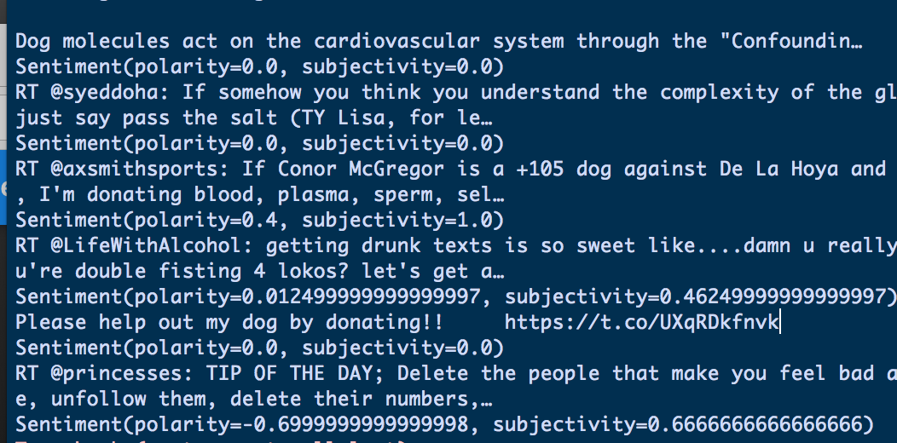

## Dog Walking Project with Swifto



### What is Swifto ?

Swifto is a NYC based dog walking company who has 60 active walkers and hundreds of clients. 


### What is the challenges they have? 

-  Time consuming to schedule walks on the phone for clients. 
-  Reaching peak point for customer aquisition. 
-  Weak relationship bond between customers. 


## Reseach First! 

We did quantitative research along with qualitative user interviews. 


### Quantitative research - Twitter's API

#### Scriping through twitter


- How many twitts about Dogwalking in New York City last two years ?

- How people feel about Dogwalking ?

- What is the top ten popular words people say about dog walking ?

**Sample code for web craping**

```
#### Use Twitter's API to do consumer research

api = tweepy.API(auth)
public_tweets = api.search('DogWalking' and 'NYC ')

#### Loop thru to get maximum results

for tweet in public_tweets:
    print(tweet.text)
    analysis = TextBlob(tweet.text)
    print(analysis.sentiment)


**Bold** and _Italic_ and `Code` text

[Link](url) and 
```

For more details see [GitHub Flavored Markdown](https://guides.github.com/features/mastering-markdown/).

### Jekyll Themes

Your Pages site will use the layout and styles from the Jekyll theme you have selected in your [repository settings](https://github.com/haohaowasky/alanwang.io/settings). The name of this theme is saved in the Jekyll `_config.yml` configuration file.

### Support or Contact

Having trouble with Pages? Check out our [documentation](https://help.github.com/categories/github-pages-basics/) or [contact support](https://github.com/contact) and we’ll help you sort it out.
